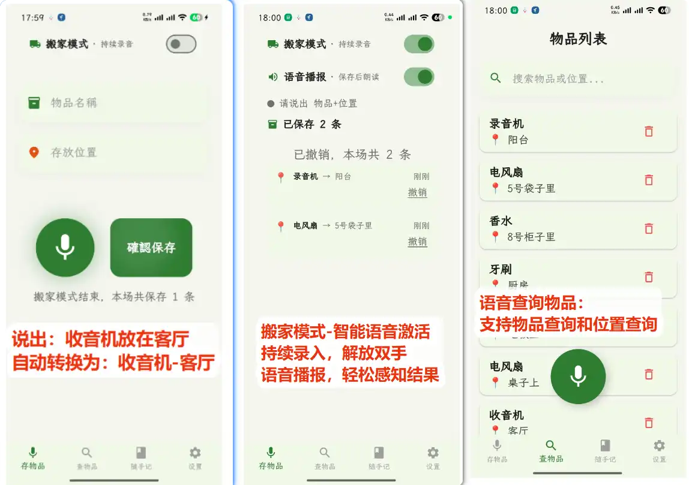
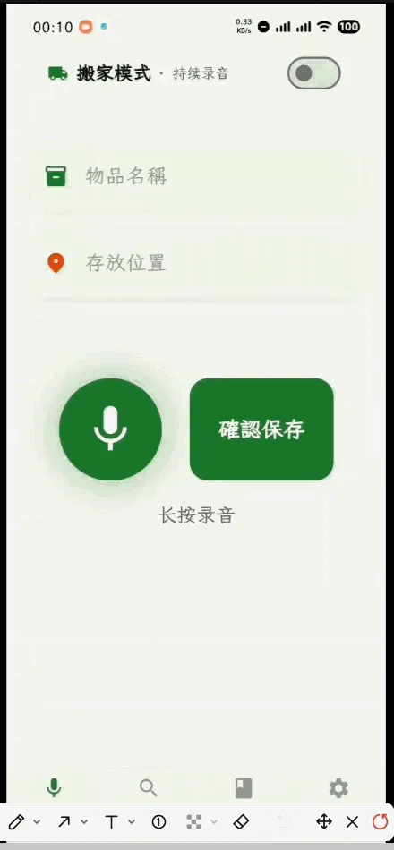
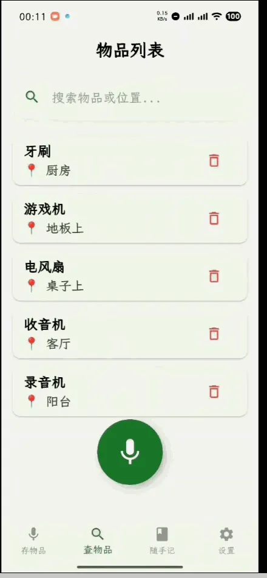
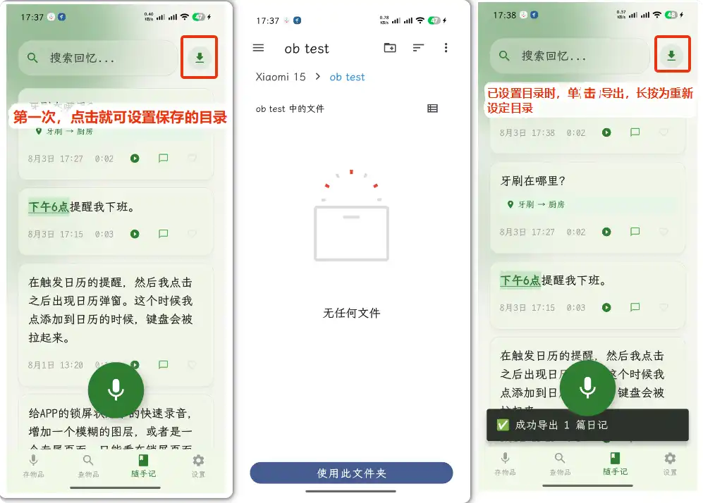

# 声物记

> 完全离线、纯本地的 Flutter 语音助手 —— 物品管理 + 闪念胶囊。
> 所有功能在本地处理，无需联网，**不上传任何用户数据**。

<p align="center">
  
</p>

使用 Flutter 开发，目前仅安卓端。内置 Sherpa-ONNX **SenseVoice** 离线语音模型（打包在 APK 中，首次启动自动部署），所有识别均在本地完成。

**核心场景：** 语音存 / 查物品、搬家模式解放双手、闪念胶囊式快速记笔记。

---

## ✨ 功能演示

### 🗣️ 语音物品管理

- **语音存物品**：长按录音说「洗发露在 3 号箱子」「牙刷在厨房小推车」，自动拆分为「物品 — 位置」并存档，不用打字。
- **语音查询（双重查询）**：着急找东西时直接问 ——
  - 「电风扇在哪」→ 电风扇在桌子上
  - 「客厅里有什么」→ 客厅里有收音机
- **热词替换**：普通话不标准？可自定义纠错映射（如把识别错的「冰响」自动替换成「冰箱」）。

<p align="center">
  
    
  
</p>

### 📦 搬家模式 · 解放双手

双手腾不出来按按钮？搬家模式下把手机放一旁即可：

- **持续录音 + Silero VAD 智能切段**，边放物品边说话，不用来回按按钮；
- **TTS 语音反馈**：识别成功会朗读「已把牙刷放入绿色箱子」，识别失败有提示音，**不用盯屏幕**；
- 说「不对 / 撤销」可自动删除上一条记录。
- ▶️ **搬家模式演示视频**（声音较大，注意调低音量）：https://www.bilibili.com/video/BV11yM96nE23/

### ⚡ 闪念胶囊 · 快速记笔记

怀念锤子的闪念胶囊？声物记把它复刻进了 app：

- **长按音量键** → 快速启动 app 并开始录音，再次长按即转写为文字；
- **双击音量键** → 直接新建文本笔记，键盘自动拉起；
- 亮屏即可触发，**未解锁状态下也能正常录音并转写**；
- 笔记中识别到时间（如「周三下午 6 点」）→ 文字变蓝可点击 → 一键创建提醒；
- 一键复制笔记内容并跳转 **ChatGPT / DeepSeek / Kimi** 继续对话（声音不外传）。

<p align="center">
  
</p>

> 快速录音需开启无障碍权限；app 完全开源、无任何联网功能，可放心开启。不开也不影响其他功能，仅影响快速录音 / 文本笔记。

### 📝 与 Obsidian 搭配

笔记可导出为 Markdown 文件，绑定 Obsidian 的文件夹，即可在手机上快速语音录入笔记到 Obsidian，补齐 Obsidian 移动端无离线语音录入、启动慢的短板。

<p align="center">
  
</p>

---

## 🎯 适用场景

- 平时总找不到东西放哪里的；
- 想做物品管理，但嫌打字太慢、效率低的；
- 搬家收纳时把物品放入某个箱子，到新家却忘了在哪个箱子；
- 封箱时塞了填充杂物（如锅碗箱里顺手塞了洗发露）却忘记标注，复原时找不到；
- 想临时记个笔记，却嫌「解锁 → 找 app → 新建 → 打字」步骤太多的。

---

## 📥 下载与源码

- **源码仓库**：https://github.com/fantasyao/shengwuji
- **下载 APK**：https://github.com/fantasyao/shengwuji/releases （下载 apk 安装即可）

## 🔒 数据 · 用户掌握

- 所有数据完全在本地，app 无联网功能；
- 笔记和物品列表均支持 **CSV 导入 / 导出**。

---

## 致谢

本 app 使用 **Flutter** 开发，语音框架为 **sherpa_onnx**，语音模型为 **SenseVoice**。

灵感来源：

- 热词替换 —— **CapsWriter**
- 音量键长按录音 —— **idea note**
- 侧滑删除动效 —— **小宇宙的订阅列表**
- 闪念胶囊 —— **锤子科技**

<!-- ============ 以下为开发者内容 ============ -->

## 构建

```bash
flutter pub get
flutter run                           # 运行
flutter build apk --split-per-abi     # 构建 APK（按 CPU 架构分包）
flutter analyze                       # 代码分析
flutter test                          # 运行测试
```

要求：Flutter 3.41.x stable、Java 17、Android SDK 34+。

## 技术栈

- **语音**：sherpa_onnx、record、audioplayers
- **数据**：sqflite、shared_preferences
- **系统**：permission_handler、vibration、wakelock_plus
- **文件**：file_picker、share_plus、archive、persistent_user_dir_access_android

## 项目结构

- `lib/main.dart` — 应用入口、4 标签页导航、快捷方式处理
- `lib/splash_screen.dart` — 启动页（冷启动初始化门控）
- `lib/recognizer_singleton.dart` — 语音识别器单例（含内置模型管理）
- `lib/db_helper.dart` — SQLite 操作（数据库 v8）
- `lib/diary_tab.dart` — 日记页（录音 / 编辑 / 归档 / 导出）
- `lib/list_extractor.dart` — 清单提取器（5 阶段管道）
- `lib/utils/dart_chrono_parser.dart` — 纯 Dart 中文时间解析器
- `android/app/src/main/java/com/shengwuji/app/` — 原生层（音量键无障碍服务、闹钟、MethodChannel 桥接）

完整架构和开发指南见 [docs/](docs/)。

## 模型文件下载

本仓库不含 SenseVoice 语音识别模型（229MB，超 GitHub 单文件限制）。

1. 前往 [Releases 页面](https://github.com/fantasyao/shengwuji/releases/latest)
2. 下载 `model.int8.onnx`
3. 放到 `assets/model.int8.onnx`
4. 运行 `flutter pub get && flutter run`
