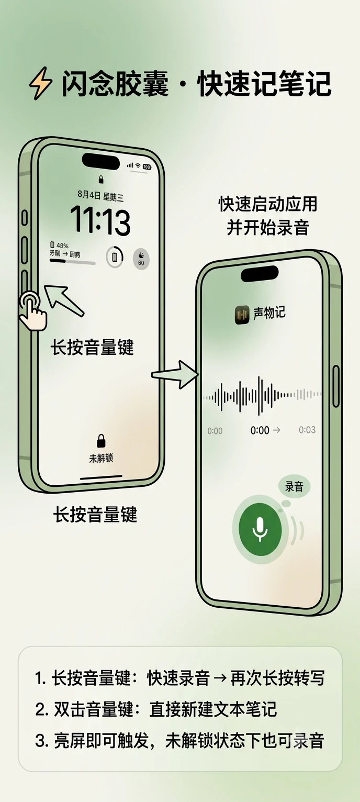
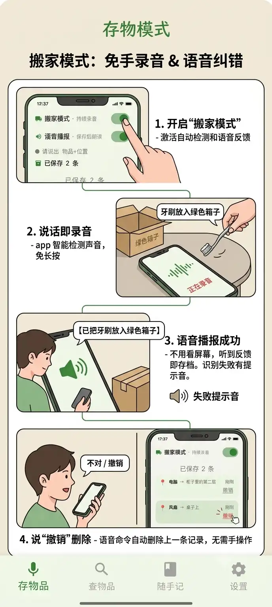
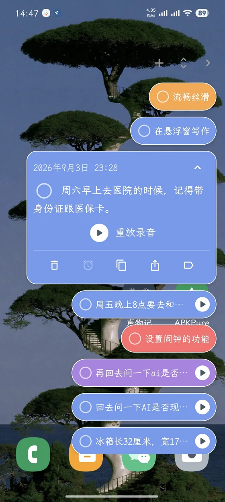
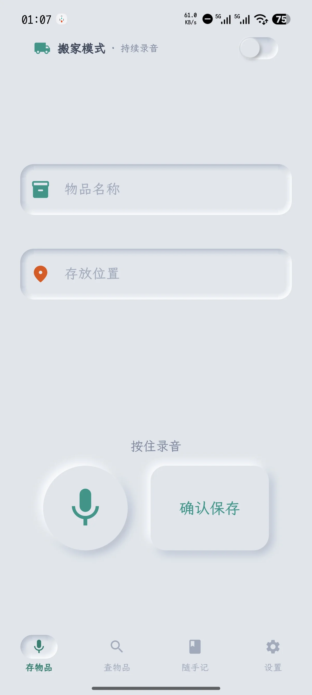
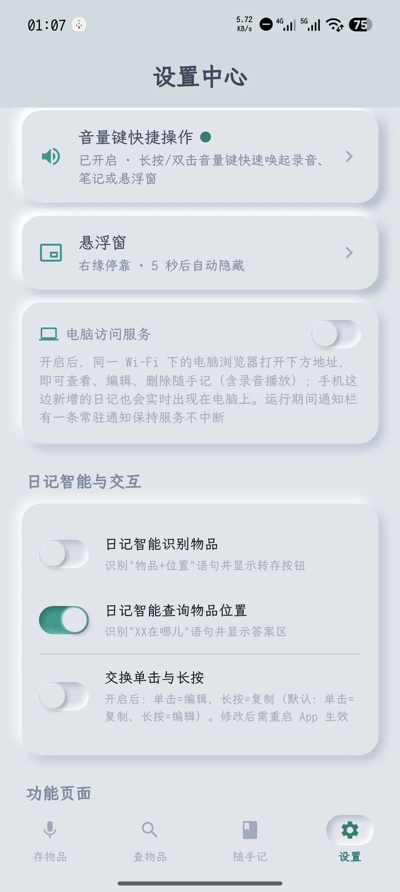

# 声物记

> 完全离线、纯本地的 Flutter 语音助手 —— 物品管理 + 闪念胶囊。
> 所有功能在本地处理，无需联网，**不上传任何用户数据**。

<p align="center">
  
</p>

使用 Flutter 开发，目前仅安卓端。内置 Sherpa-ONNX **SenseVoice** 离线语音模型（打包在 APK 中，首次启动自动部署），所有识别均在本地完成。

**核心场景：** 语音存 / 查物品、搬家模式解放双手、闪念胶囊式悬浮随手记 —— 任意界面、免跳转，还能语音定闹钟。

<p align="center">
  
</p>

---

## ✨ 功能演示

### 🗣️ 语音物品管理

- **语音存物品**：长按录音说「洗发露在 3 号箱子」「牙刷在厨房小推车」，自动拆分为「物品 — 位置」并存档，不用打字。
- **语音查询（双重查询）**：着急找东西时直接问 ——
  - 「电风扇在哪」→ 电风扇在桌子上
  - 「客厅里有什么」→ 客厅里有收音机
- **热词替换**：普通话不标准？可自定义纠错映射（如把识别错的「冰响」自动替换成「冰箱」）。

<p align="center">
  
    
  
</p>

### 📦 搬家模式 · 解放双手

双手腾不出来按按钮？搬家模式下把手机放一旁即可：

- **一直开着就能说**：自动听出每句话的开头和结尾，说一句记一条，边放物品边说话，不用来回按按钮；
- **语音播报反馈**：每存好一件会朗读「已把牙刷放入绿色箱子」，识别失败有提示音，**不用盯屏幕**；
- 说「不对 / 撤销 / 删掉 / 删除」等关键词（10 秒内）可自动删除上一条记录。

<p align="center">
  
</p>
- ▶️ **搬家模式演示视频**（声音较大，注意调低音量）：https://www.bilibili.com/video/BV11yM96nE23/

### ⚡ 闪念胶囊 · 悬浮窗随手记

怀念锤子的闪念胶囊？声物记把整套体验**深度复刻**成了系统级悬浮窗 —— 1:1 还原胶囊交互，还更进一步：**不用跳转 app**，任何界面长按音量键即呼出，说完即走，完全不打断当前操作（Pro 功能）：

- **长按音量键** → 悬浮窗弹出并自动展开最近笔记；显示中再按立即隐藏；
- **语音速记 / 文本笔记**：面板顶部「+」一键新建文本笔记（键盘自动弹起），语音速记直达、上限 5 分钟；点卡片展开全文直接编辑；
- **🆕 语音定闹钟**：点卡片闹钟按钮说「周六晚上八点提醒我去看电影」→ 自动识别时间 → 转轮确认 → 写入系统日历，到点响铃；「晚上八点」「两点半」这类中文说法随口说也能识别；
- 卡片支持**标注换色**：紧急 ❗ / 收藏 ⭐ / 灵感 💡，主 App 日记页同步显示色点；
- **🆕 左滑归档 / 删除**：左滑卡片把笔记收进已归档（与日记页同款滑动交互），已归档卡片再左滑即彻底删除；卡片上右滑照常收起悬浮窗；
- 语音速记的卡片自带**录音回放**，支持重放 / 暂停 / 继续；
- 一键复制笔记内容、跳转 **ChatGPT / DeepSeek / Kimi** 继续对话（声音不外传）；
- 笔记中识别到时间（如「周三下午 6 点」）→ 文字变蓝可点击 → 一键创建提醒；
- 从其他 App 选中文字 → 分享到「声物记」，直接保存为文本笔记；
- 收起后自动隐藏（5 / 10 / 30 秒或永久常驻可选），平时完全零打扰。

<p align="center">
  
</p>

> 音量键手势支持长按 / 双击四槽位自定义：不想弹悬浮窗，也可以把槽位设回主 App 的快速录音 / 新建文本笔记（未解锁状态下也能正常录音并转写）。
> 悬浮窗与快速录音需开启无障碍权限；app 完全开源、无任何联网功能，可放心开启。不开也不影响其他功能，仅影响悬浮窗 / 快速录音。
> 不同手机权限要求不同：可能需要额外开启：锁屏展示、后台弹出页面、自启动、省电策略-无限制

### 📝 与 Obsidian 搭配

笔记可导出为 Markdown 文件，绑定 Obsidian 的文件夹，即可在手机上快速语音录入笔记到 Obsidian，补齐 Obsidian 移动端无离线语音录入、启动慢的短板。

<p align="center">
  
</p>

---

## 🎯 适用场景

- 平时总找不到东西放哪里的；
- 想做物品管理，但嫌打字太慢、效率低的；
- 搬家收纳时把物品放入某个箱子，到新家却忘了在哪个箱子；
- 封箱时塞了填充杂物（如锅碗箱里顺手塞了洗发露）却忘记标注，复原时找不到；
- 想临时记个笔记，却嫌「解锁 → 找 app → 新建 → 打字」步骤太多的。

---

## 📥 下载与源码

- **源码仓库**：https://github.com/fantasyao/shengwuji
- **下载 APK**：https://github.com/fantasyao/shengwuji/releases （下载 apk 安装即可）

## 🔒 数据 · 用户掌握

- 所有数据完全在本地，app 无联网功能；
- 支持 **ZIP 全量备份 / 恢复**（含日记、物品、录音文件、热词配置）。

---

## 📝 更新日志

> 同步于 App 内「设置 → 关于 → 版本更新日志」。

**v1.4.0**（2026-09-24）

🚀 新功能

- 云同步来了（WebDAV）：支持坚果云等 WebDAV 网盘，一键同步笔记、物品、热词与修正对，可开启「同步录音文件」把语音一起备份上云；多台设备数据自动合并，有新数据待同步时会提示
- 热词升级为音素匹配（灵感来自开源项目 CapsWriter）：按发音（而非文字）模糊比对，平翘舌、前后鼻音、n/l 等常见听错自动纠正；热词新增「正词 | 别名」写法；同一处修正满 3 次会主动提议加入热词
- 音量键新增「按住说话」：像对讲机一样按住说话、松开自动停止并转写，不用再找屏幕按钮
- 笔记锁定：单条笔记可上锁，正文打码防偷看，指纹或锁屏密码解锁，锁屏自动重新上锁
- AI 应用分享支持自定义：除内置应用外，可添加手机里任意已安装的 AI 应用（最多 3 个）

✨ 体验优化

- 悬浮窗息屏自动隐藏：锁屏 / 息屏时钟（AOD）上不再残留把手，亮屏后原样恢复
- 音量键长按触发时长更好调：档位整体下调为 0.2 / 0.3 / 0.4 / 0.7 秒四档，还能自定义 50 毫秒～2 秒任意时长
- 悬浮窗卡片标注按钮提到时间行直接点，时间改横杠格式更省空间
- 修正对管理支持按命中次数、最近命中时间排序，排查高频识别错误更方便
- 「听起来像热词」提示更快消失，不再长时间停留

🎨 界面与个性化

- 自定义主题（Pro）：色盘挑一个主色自动生成整套配色，背景、按钮、选中色还能单独微调
- 悬浮窗把手可自定义：大小三档（标准 / 小 / 迷你）+ 外观三套（双色药丸 / 蓝紫 / 拟物胶囊）
- 启动页焕新：全新「深海极光」渐变配色

🛠 问题修复

- 备份导入后笔记重复、归档笔记复活
- 覆盖安装后首次启动偶发数据库报错
- 息屏时钟（AOD）状态按音量键无法调音量
- 12 小时制手机日历时间拨轮显示不全；日历写入失败时提示更具体
- 把手调小后部分区域点不灵；弹出指纹解锁时悬浮窗自动让位

**v1.3.0**（2026-09-20）

- 全新「新拟物」主题：第 5 套皮肤——经典拟物灰底 + 轻盈立体光影，按钮、开关、输入框、底部导航全套凹凸质感（Pro 功能）
- 悬浮窗需要 Pro 解锁才能使用：未解锁时按音量键会震动并提示「暂未解锁」，可在设置页解锁或先免费试用 7 天
- Pro 解锁方式升级为授权码：扫码付款后，把付款截图 + App 里显示的安卓 ID 发邮件给作者，收到授权码在 App 里输入即可（绑定手机）
- 旧版解锁方式已停用：旧版「点一下就解锁」的方式升级后失效，确已付款的用户可发邮件补发授权码
- 音量键长按触发时长可调：设置页新增 快(400毫秒) / 标准(500) / 慢(800) / 很慢(1200) 四档，默认仍是约 0.5 秒
- 录音中按一下音量键即可结束：设置页可开启「单击音量键停止录音」——录完点一下就停并转写，不用再长按；耳机线控 / 蓝牙耳机按键 / 相机键同样支持（与「按音量减保持静音」二选一）
- 体验优化与修复：设置页标题样式统一、识别修正页开关贴边与同音词示例修正等

<p align="center">
  
    
  
</p>

**v1.2.0**（2026-09-17）

- 电脑在线访问：同一 Wi-Fi 下，用电脑浏览器打开 App 里显示的网址，就能查看 / 编辑日记、回放录音
- 悬浮窗把手升级：收起后的竖条可以放在屏幕左边或右边，点一下 / 往里一滑就展开；长按把手支持上下拖动，挪到顺手的位置
- 录音更省心：说完话停一下就自动停止录音，不用再手动点
- 识别修正（未完成版）：修正对与同音词修复——把常识别错的词教给 App，以后自动改对
- 设置页重新整理：常用功能归类到二级页面，操作震感也更舒服
- 支持隐藏存物品页和查物品页
- 退出 App 时自动停止录音
- 新增「悬浮窗语音速记」快捷方式：适合有自定义按键（非滑动式）的手机——按一下弹出悬浮窗开始录音，再按一下停止
- 带滑动式按键的手机（如努比亚滑动键）：建议把按键映射到「快速录音」，上滑开始录音、滑回退出时自动停止

**v1.1.0**（2026-09-06）

- 全新悬浮窗（闪念胶囊）：把闪念胶囊 1:1 搬进系统级悬浮窗，任意界面长按音量键即呼出——不用跳转 app、不打断当前操作，说完即走，收起后自动隐藏（Pro 功能）
- 悬浮窗语音定闹钟：点卡片闹钟按钮说「周六晚上八点提醒我去看电影」，自动识别时间，转轮确认后写入系统日历，到点响铃；「晚上八点」「两点半」等中文说法随口说也能识别
- 音量键唤醒悬浮窗：长按音量键唤出并自动展开最近笔记，显示中再按立即隐藏；音量键手势升级为长按 / 双击四槽位自定义
- 悬浮窗快速新建：面板顶部「+」一键新建笔记，自动弹起键盘进入编辑；点卡片展开全文直接编辑
- 悬浮窗卡片标注：紧急 / 收藏 / 灵感三种标注整卡换色，主 App 日记页同步显示色点
- 悬浮窗录音回放：语音速记卡片自带播放按钮，支持重放 / 暂停 / 继续
- 悬浮窗录音也支持临时静音：与快捷录音共用「按音量减保持静音」开关，录音期间按音量减，结束后继续保持静音
- 日历提醒确认更省心：日期在月视图日历上点一下就选好、时分拨轮分钟级微调（拨动带线性马达段落震感），标题所见即所得，响铃开关可只建日历事件；窄屏自动改为上下排布；缺权限时自动引导回主 App 授权，无通知权限自动改为仅日历提醒
- 悬浮窗语音速记录音上限 60 秒 → 5 分钟；悬浮窗记录与主 App 日记实时同步
- 语音转文字不再卡顿：转写挪到后台进行，转写期间刷列表、打字依旧流畅
- 备份导出 / 导入更稳更快：打包在后台完成不卡顿，等待期间 app 可正常使用，也修复了备份导入导出会报错的问题
- Pro 解锁更贴心：扫码付款回来后点「已扫码，点击解锁」即可，不用再走付费入口
- 搬家模式语音播报更顺滑：播报在后台生成，边收边说不卡顿
- 闹钟到点即时提醒：响铃提示立即弹出，不再有可感知的等待
- 一批顺滑度优化：日记搜索更跟手、悬浮窗收展更流畅、拖动录音按钮更跟手，整体更省电

**v1.0.17**（2026-08-18）

- 日记页录音按钮支持上滑-快速新建文本笔记
- 设置页将「静音提示」开关与「按音量减保持静音」开关整合在一起
- 临时静音保持功能-新增开关
- 隐藏日记卡片底部未实现的爱心图标，等待后续功能完善

**v1.0.16**（2026-08-12）

- 随手记 / 日记卡片归档后可一键恢复（新增恢复入口）
- 日记卡片「单击 / 长按」交互支持自定义交换
- 接收系统分享：从其他 App 选文字分享到声物记，直接存为笔记
- 热词配置纳入全量备份 / 恢复

**v1.0.15**（2026-08-07）

- 日记卡片改版：日期 / 时长移至顶部，补全年份与时分格式
- 播放按钮升级为带响度波纹的可拖动进度条（支持拖动跳转 / 暂停继续）
- 转写中按钮区禁用态；修复进度条游标「先走再跳回」与暂停后续播虚高
- 搬家模式智能分割失败提示改为可左滑消除的自绘提示条（含手动保存按钮）

**v1.0.14**（2026-08）

- 主题系统改版（4 套皮肤预设 + Android 桌面图标包切换，Pro 功能）
- 搬家模式增强（语音播报 + 说「不对/撤销」语音撤销 + 屏幕常亮省电遮罩）
- 录音防丢失（先落盘再转写，失败可重新转写）
- 长录音自动分段，说太久也不丢内容
- 待办清单需以「代办/待办」开头才识别，正常说话不会误判
- 锁屏隐私保护与音量键键盘修复
- 物品列表浮动语音查询按钮
- Pro 弹窗接入真实付款码
- 录入/日记页按钮钉底便于单手操作
- 修复窄屏卡片底部信息栏溢出
- 补齐霞鹜文楷字体 OFL 开源协议

**v1.0.13**（2026-06）

- 日记一键转物品（浅橙横条转存按钮）
- 设置页新增 Pro 付费解锁弹窗（支持作者）
- 录音按钮样式统一
- 修复双击音量键键盘抖动

**v1.0.12**（2026-06）

- 日记页语音查找物品：说「游戏机在哪儿」自动在卡片下方展示物品位置答案，多匹配显示 +N 跳转列表

**v1.0.11**（2026-06）

- 日记页首次启动内置 7 条功能说明卡片

**v1.0.10**（2026-06）

- 应用改名「东西放哪儿了 → 声物记」，包名更新为 com.shengwuji.app

---

## 开源许可

本项目源码以 **Apache License 2.0** 开源，详见 [LICENSE](LICENSE) 文件。

本 app 使用 **Flutter** 开发，语音框架为 **sherpa_onnx**，语音模型为 **SenseVoice**。

开源字体：

- [霞鹜文楷 LXGW WenKai](https://github.com/lxgw/LxgwWenKai) —— 中文字体，基于 SIL Open Font License 1.1 协议，协议全文见 App「设置 → 关于 → 开放源代码许可」。

灵感来源：

- 热词替换与音素匹配 —— **CapsWriter**
- 音量键长按录音 —— **idea note**
- 侧滑删除动效 —— **小宇宙的订阅列表**
- 闪念胶囊 —— **锤子科技**

<!-- ============ 以下为开发者内容 ============ -->

## 构建

```bash
flutter pub get
flutter run                           # 运行
flutter build apk --split-per-abi     # 构建 APK（按 CPU 架构分包）
flutter analyze                       # 代码分析
flutter test                          # 运行测试
```

要求：Flutter 3.41.x stable、Java 17、Android SDK 34+。

## 技术栈

- **语音**：sherpa_onnx、record、audioplayers
- **数据**：sqflite、shared_preferences
- **系统**：permission_handler、vibration、wakelock_plus
- **文件**：file_picker、share_plus、archive、persistent_user_dir_access_android

## 项目结构

- `lib/main.dart` — 应用入口、4 标签页导航、快捷方式处理
- `lib/splash_screen.dart` — 启动页（冷启动初始化门控）
- `lib/recognizer_singleton.dart` — 语音识别器单例（含内置模型管理）
- `lib/db_helper.dart` — SQLite 操作（数据库 v8）
- `lib/diary_tab.dart` — 日记页（录音 / 编辑 / 归档 / 导出）
- `lib/list_extractor.dart` — 清单提取器（5 阶段管道）
- `lib/theme/app_theme.dart` / `lib/theme/app_theme_extension.dart` — 主题/皮肤系统（5 套预设 + ThemeExtension）
- `lib/utils/icon_pack_switcher.dart` — Android 图标包切换桥接
- `android/app/src/main/java/com/shengwuji/app/` — 原生层（音量键无障碍服务、闹钟、MethodChannel 桥接）

完整架构和开发指南见 [docs/](docs/)。

## 模型文件下载

本仓库不含 SenseVoice 语音识别模型（229MB，超 GitHub 单文件限制）。

1. 前往 [Releases 页面]([https://github.com/fantasyao/shengwuji/releases/tag/v1.0)
2. 下载 `model.int8.onnx`
3. 放到 `assets/model.int8.onnx`
4. 运行 `flutter pub get && flutter run`
